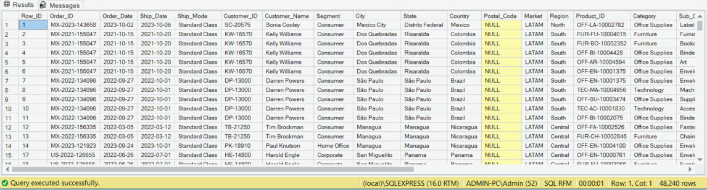
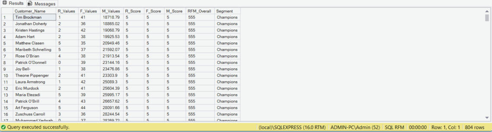
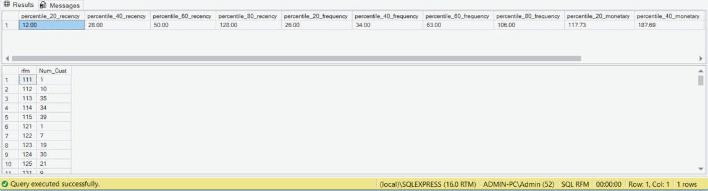

# RFM Customer Segmentation with SQL Server

Customer segmentation of a global retail order dataset using RFM analysis (Recency, Frequency, Monetary), written entirely in T-SQL. The project implements two scoring methods and compares them: equal-sized groups with `NTILE`, and value thresholds with `PERCENTILE_DISC`.

## Business question

A retailer cannot treat every customer the same way. RFM turns raw order history into a three-digit code per customer that answers:

| Metric | Question | Better when |
|---|---|---|
| **R**ecency | How long since the last purchase? | Lower |
| **F**requency | How often does the customer buy? | Higher |
| **M**onetary | How much has the customer spent? | Higher |

The code is then used to decide who to reward, who to win back, and who is not worth further marketing spend.

## Dataset

| File | Rows | Description |
|---|---|---|
| `Orders_Full.csv` | 51,290 | One row per product line in an order, 1 Jan 2020 to 31 Dec 2023, 7 markets |
| `Return_Full.csv` | 1,173 | Order IDs that were returned (1,172 distinct orders) |
| `segment_scores.csv` | 128 | Lookup from RFM code to segment name (11 segments) |

The source files are in the [`data/`](data/) folder. It also contains `customer.csv` and `sales.csv`, which were supplied with the dataset but are not used by this analysis.

Key columns used from `Orders_Full`: `Order_ID`, `Order_Date`, `Customer_ID`, `Customer_Name`, `Sales`.

## Tools

- Microsoft SQL Server and SSMS
- Excel for cleaning date formats before import

## Workflow

```
Orders_Full (51,290 rows)
    │  remove returned orders
    ▼
New_Orders view (48,240 rows)
    │  aggregate per customer
    ▼
R, F, M values
    │  score 1–5
    ▼
RFM code (e.g. 545)
    │  look up in segment scores
    ▼
Segment name (e.g. Champions)
```

### 1. Data preparation

- Fixed mixed date formats in Excel (source dates are `mm/dd/yyyy`; a `dd/mm/yyyy` locale reads some as text and silently swaps day and month in others).
- Imported with the SSMS Import Flat File wizard, widening `Postal_Code` to `nvarchar(20)` after a truncation error.

### 2. Remove returned orders

The view `New_Orders` uses `EXCEPT` to drop every order that appears in `Return_Full`, so returned sales are not counted as revenue. This removes 1,172 orders (3,050 rows).

Result of `SELECT * FROM New_Orders` (48,240 rows):



### 3. Method 1: `NTILE` scoring

A chain of three CTEs, grouped by `Customer_Name` (795 customers):

| CTE | Purpose |
|---|---|
| `RFM_base` | Recency = days from last order to 2023-12-31; Frequency = distinct order dates; Monetary = total sales |
| `RFM_Score` | `NTILE(5)` splits customers into five equal groups per metric |
| `RFM_Final` | `CONCAT` joins the three scores into one code |
| Final `SELECT` | `LEFT JOIN` to `[segment scores]` attaches a segment name to each code |

Recency is ordered `DESC` and the other two `ASC`, so 5 is always the best score and `555` is the best customer.

Approximate score boundaries on this dataset (159 customers per group):

| Score | Recency (days) | Frequency (order days) | Monetary (total sales) |
|---|---|---|---|
| 1 | 37 – 428 | 14 – 26 | 3,344 – 10,792 |
| 2 | 22 – 37 | 26 – 29 | 10,792 – 13,088 |
| 3 | 13 – 22 | 29 – 32 | 13,112 – 15,440 |
| 4 | 5 – 13 | 32 – 35 | 15,445 – 18,631 |
| 5 | 0 – 5 | 35 – 46 | 18,643 – 40,488 |

The query returns one row per customer with the three values, the three scores, the RFM code and the segment:



Grouping that result by segment gives the following customers and revenue per segment (SQL Server 2022):

| Segment | Customers | Total sales |
|---|---|---|
| At Risk | 129 | 2,214,043 |
| Potential Loyalist | 114 | 1,429,247 |
| Hibernating customers | 107 | 1,291,807 |
| New Customers | 79 | 753,982 |
| Champions | 78 | 1,677,078 |
| Loyal | 74 | 1,381,021 |
| Promising | 57 | 915,188 |
| Lost customers | 52 | 488,365 |
| Need Attention | 42 | 730,314 |
| About To Sleep | 37 | 368,261 |
| Cannot Lose Them | 35 | 662,345 |

At Risk is both the largest segment and the one holding the most revenue, which makes it the first priority for win-back campaigns.

The counts add up to 804 rather than 795 because three codes (`231`, `241`, `251`) appear under two segments in the lookup, so 9 customers are counted twice. `NTILE` also breaks ties arbitrarily, so counts can shift by a few customers between runs.

### 4. Method 2: percentile thresholds

Grouped by `Customer_ID`, with different metric definitions:

- Recency = days from last order to 2024-01-01
- Frequency = days since first order ÷ number of order lines (average days between purchases, lower is better)
- Monetary = total sales ÷ number of order lines (average value per line)

Steps:

1. `PERCENTILE_DISC(0.2 … 0.8)` finds the four cut-off values for each metric; results are saved to `RFM_RawData`.
2. The twelve cut-offs are loaded into variables.
3. `CASE WHEN` compares each customer in `RFM_RawData` with the cut-offs to assign a score, then customers are counted per RFM code.

The thresholds and the number of customers per RFM code:



All three metrics are ordered ascending here, so low values score 1. The best customer in this method is `115`, not `555`.

### Comparing the two methods

| | `NTILE` | Percentile thresholds |
|---|---|---|
| Group sizes | Always equal | Can be uneven |
| Customers with identical values | May get different scores | Always get the same score |
| Code length | Short | Longer, needs a table and variables |
| Best customer code | `555` | `115` |

## How to run

1. Import the three CSV files as `Orders_Full`, `Return_Full` and `[segment scores]`.
2. Open [`sql/RFM_Project.sql`](sql/RFM_Project.sql) in SSMS and execute it. The script is split into batches with `GO`, and it uses `CREATE OR ALTER VIEW` and `DROP TABLE IF EXISTS`, so it can be re-run safely.

To run it piece by piece instead, keep these rules in mind:

- `CREATE OR ALTER VIEW New_Orders` must be run on its own, without the statements around it.
- The Method 1 block must be selected from `;with RFM_base` down to its final `ORDER BY`.
- Everything from the first `DECLARE` to the end of the file must be run together, because variables only exist within a single batch.

## Notes and limitations

- Customer identity. The data has 1,590 `Customer_ID` values but only 795 names; each name maps to exactly two IDs. Method 1 groups by name and Method 2 by ID, so the two methods count customers differently.
- Recency has little spread. Half of all customers bought within the last 17 days of the period, so R scores 4 and 5 differ by only a few days. F and M carry more information on this dataset.
- Scores are relative. The bottom 20% always score 1, even if they are good customers in absolute terms.
