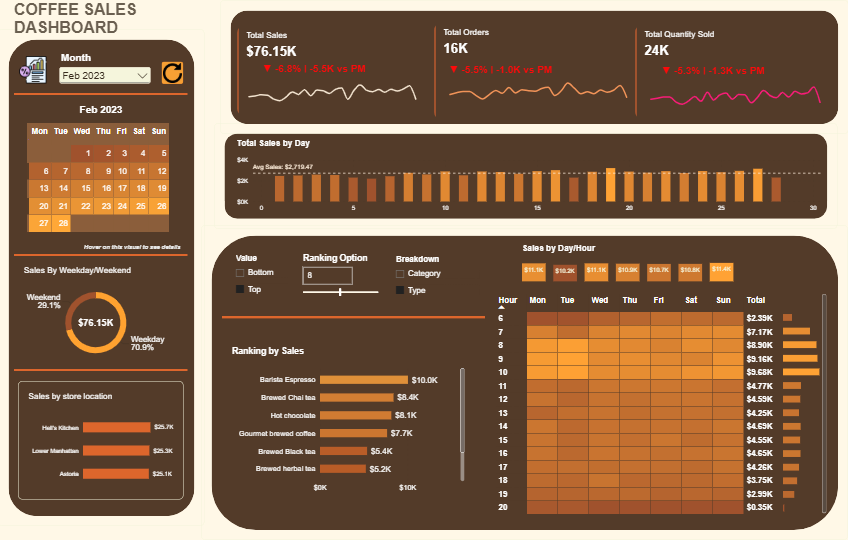
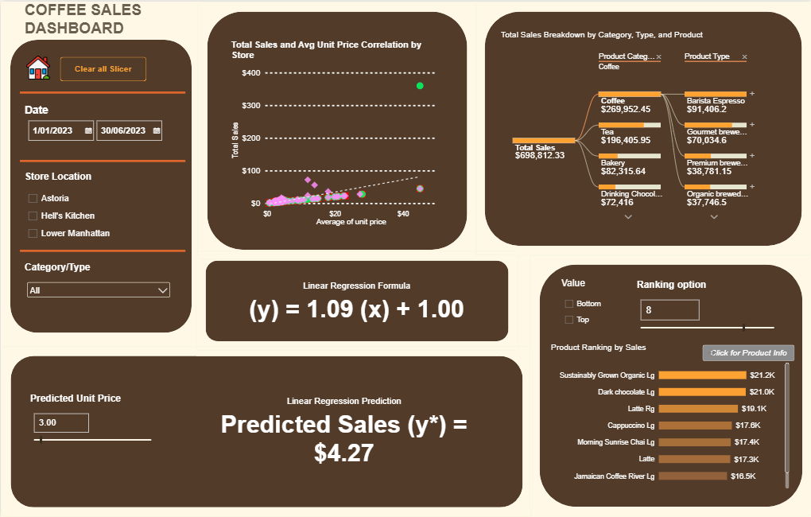
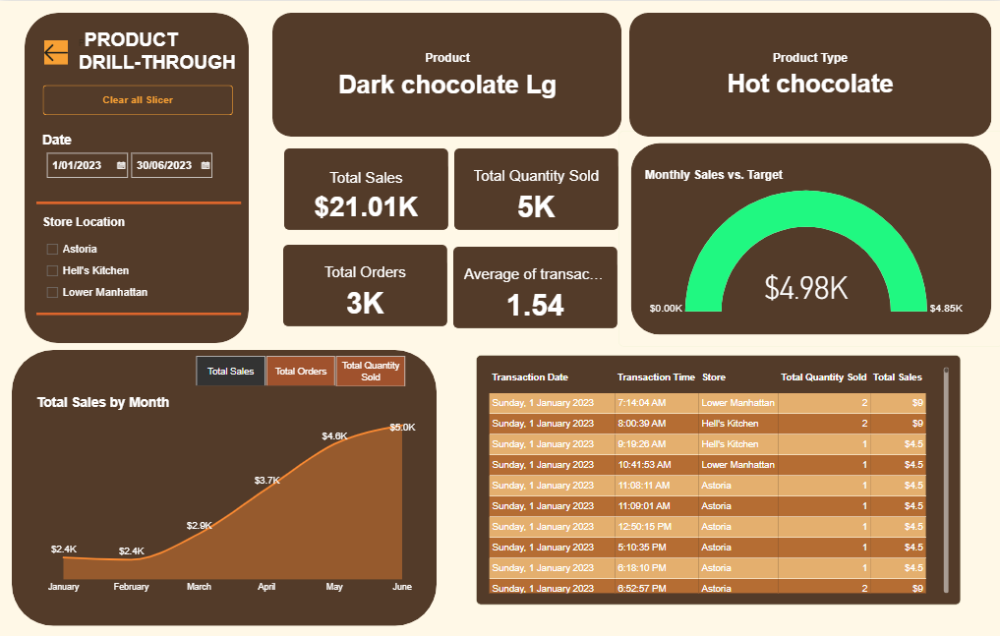

# Coffee Sales Analysis

A Power BI report on six months of transactions (January to June 2023) from a coffee shop chain with three New York stores: Astoria, Hell's Kitchen and Lower Manhattan. One flat Excel export is reshaped into a star schema in Power Query and analysed with DAX to show how sales trend, when customers buy and which products carry revenue.

  

## Table of Contents

- [Problem Statement](#problem-statement)
- [Data Source](#data-source)
- [Architecture](#architecture)
- [Semantic Model](#semantic-model)
  - [Relationships](#relationships)
  - [Measures](#measures)
- [Business Insights](#business-insights)
  - [Monthly Overview](#monthly-overview)
  - [Sales Correlation and Forecast](#sales-correlation-and-forecast)
  - [Product Drillthrough](#product-drillthrough)
  - [Recommendations](#recommendations)

## Problem Statement

The project answers four questions for the store managers:

1. **How are sales trending?** Whether revenue, orders and quantity grow month over month.
2. **When do customers buy?** Which hours and days bring in the most revenue, so staffing and stock can be planned.
3. **What do they buy?** Which categories, product types and individual products lead or lag.
4. **Where do they buy?** How the three stores compare.

The report also fits a straight line between unit price and sales, so a manager can pick a price and read an estimated sales value per transaction.

## Data Source

The data is the Coffee Shop Sales dataset from Maven Analytics: one Excel table with **149,116 transaction rows** from **1 January to 30 June 2023**.

| Column | What it holds |
|---|---|
| `transaction_id` | One id per transaction line |
| `transaction_date`, `transaction_time` | When the sale happened |
| `transaction_qty` | Units sold |
| `store_id`, `store_location` | Which of the three stores |
| `product_id`, `unit_price` | Product sold and its price |
| `product_category`, `product_type`, `product_detail` | Three-level product description |

## Architecture

All preparation happens inside Power BI. Each layer has one job.

| Layer | Tool | Purpose |
|---|---|---|
| 1 | CSV file | Flat source table, one row per transaction line |
| 2 | Power Query | Set data types, split the flat table into fact and dimension tables, remove duplicates, add surrogate keys (`category_id`, `type_id`) |
| 3 | Data model | Star schema with a snowflaked product hierarchy, a calendar table and a time table built in DAX |
| 4 | Report | Three report pages and two tooltip pages |

## Semantic Model

The model has one fact table, six dimensions and a `Measure Table` that holds all DAX measures.

| Table | Rows | What it holds |
|---|---:|---|
| `Fact_Transaction` | 149,116 | Date, time, store, product, quantity, unit price, and a `Sales` column (`transaction_qty × unit_price`) |
| `Dim_Date` | 181 | Calendar built with `CALENDAR` over the transaction dates: year-month, week number, weekday, weekend flag |
| `Dim_Time` | 86,400 | One row per second of the day, with hour and minute |
| `Dim_Store` | 3 | Store location |
| `Dim_Product` | 80 | Product name |
| `Dim_Type` | 29 | Product type |
| `Dim_category` | 9 | Product category |

Six small helper tables drive the slicers: `Breakdown` and `Metrics` (field parameters), `TopBottom`, `Ranking Option`, `Category/Type Ranking Option` and `Predicted Unit Price`.

### Relationships

All relationships are many-to-one with single-direction filtering.

| From | To |
|---|---|
| `Fact_Transaction[store_id]` | `Dim_Store[store_id]` |
| `Fact_Transaction[product_id]` | `Dim_Product[product_id]` |
| `Dim_Product[type_id]` | `Dim_Type[type_id]` |
| `Dim_Type[category_id]` | `Dim_category[category_id]` |
| `Fact_Transaction[transaction_date]` | `Dim_Date[Date]` |
| `Fact_Transaction[transaction_time]` | `Dim_Time[Time]` |

### Measures

| Measure | Logic |
|---|---|
| `Total Sales` | `SUMX` of `transaction_qty × unit_price` over the fact table |
| `Total Orders` | Count of `transaction_id` |
| `Total Quantity Sold` | Sum of `transaction_qty` |
| `CM Sales`, `PM Sales` (and the same for orders and quantity) | Current month with `DATESMTD`; previous month by shifting it with `DATEADD(-1, MONTH)` |
| `MoM Growth & Sales Diff` | Text label with an arrow, the percentage change and the difference in thousands against the previous month |
| `Sales Target` | Previous month sales × 1.05 |
| `Category & Type Ranking` | `RANKX` over all categories or types; returns sales only for the Top or Bottom N chosen in the slicers |
| `Product Ranking` | Dense `RANKX` over the selected products; Top or Bottom N, default 5 |
| `Linear Regression Formula` | Slope and intercept from the least-squares formulas, written with `SUMX` for Σxy and Σx² |
| `Linear Regression Prediction` | Slope × the unit price picked in the slicer + intercept |
| `Selected Product Type` | Uses `CROSSFILTER(..., BOTH)` so the drill-through page shows the product's type without changing the model |

## Business Insights

### Monthly Overview

  

- **Revenue is \$698.8K and has doubled since January.** Monthly sales went from \$81.7K in January to \$166.5K in June. February was the only month that fell (−6.8%), and it has the fewest trading days.
- **Growth is slowing.** Sales grew 30% in March, 20% in April and 32% in May, then 6% in June.
- **Three morning hours bring in 37% of revenue.** 8, 9 and 10 AM earn \$83K to \$89K each, about twice any afternoon hour (\$40K to \$42K). Sales after 8 PM are close to zero.
- **Every day of the week sells about the same.** Monday is highest (\$101.7K) and Saturday lowest (\$96.9K), a gap of 5%. Weekdays hold 72% of sales, which is what five days out of seven would give.
- **The three stores are level.** Hell's Kitchen \$236.5K, Astoria \$232.2K, Lower Manhattan \$230.1K; the gap from first to last is under 3%.
- **Coffee and tea make up two thirds of sales.** Coffee \$270.0K (39%) and Tea \$196.4K (28%), then Bakery \$82.3K and Drinking Chocolate \$72.4K.

| Month | Sales | Orders | Quantity |
|---|---:|---:|---:|
| January | \$81.7K | 17,314 | 24,870 |
| February | \$76.1K | 16,359 | 23,550 |
| March | \$98.8K | 21,229 | 30,406 |
| April | \$118.9K | 25,335 | 36,469 |
| May | \$156.7K | 33,527 | 48,233 |
| June | \$166.5K | 35,352 | 50,942 |

### Sales Correlation and Forecast

  

- **Four product types lead:** Barista Espresso \$91.4K, Brewed Chai Tea \$77.1K, Hot Chocolate \$72.4K and Gourmet Brewed Coffee \$70.0K.
- **Large sizes top the product ranking.** Four of the five best sellers are large: Sustainably Grown Organic Lg \$21.2K, Dark Chocolate Lg \$21.0K, Latte Rg \$19.1K, Cappuccino Lg \$17.6K, Morning Sunrise Chai Lg \$17.4K.
- **The weakest products earn under \$1.4K each in six months:** packaged Dark Chocolate (\$0.8K), Earl Grey, Spicy Eye Opener Chai, Guatemalan Sustainably Grown, Lemon Grass and Peppermint.
- **Sales per transaction rise in step with price.** The fitted line is y = 1.09x + 1.00: each extra dollar of unit price adds about \$1.09 to a transaction line.

### Product Drillthrough

  

This page opens from a product on the ranking chart. It shows that product's type, its sales, orders and quantity, the monthly trend for the metric chosen in the slicer, its individual transactions, and a gauge of the current month against a target of 5% above the previous month.

### Recommendations

1. **Staff and stock for 7 to 10 AM.** These four hours hold 46% of revenue; shift staff hours from the afternoon and evening to the morning.
2. **Review opening hours after 8 PM.** Six months of sales in that hour total \$2.9K across all three stores.
3. **Promote large sizes.** They already lead the ranking, so make Large the suggested size at the till.
4. **Trim or rotate the slowest products.** The bottom six together earn about \$7.4K in six months.
5. **Run promotions chain-wide.** Stores and weekdays perform alike, so there is no weak store or weak day to target.
