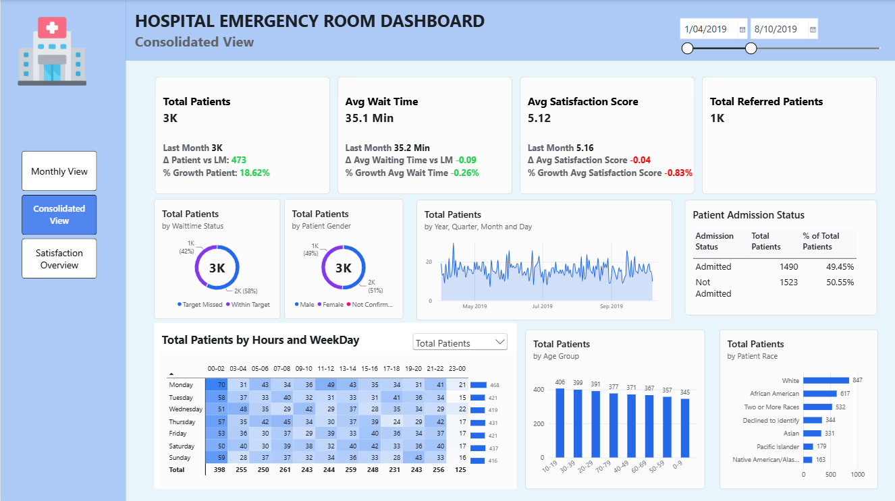
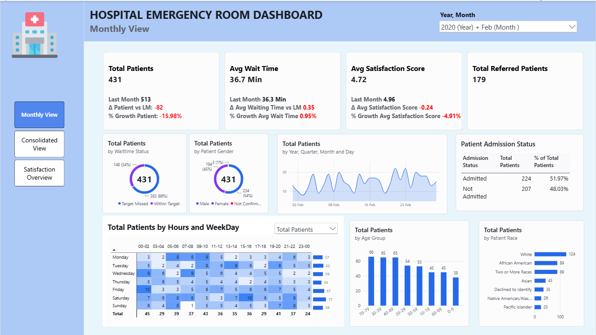
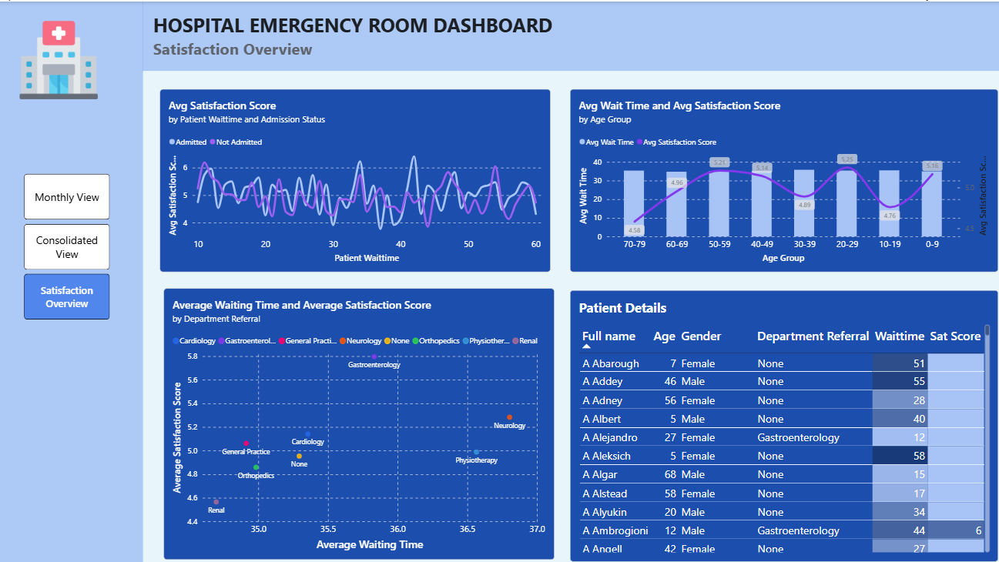

# Hospital Emergency Room Analysis

A Power BI report on 9,216 emergency room visits recorded between April 2019 and October 2020. One CSV export is cleaned in Power Query and analysed with DAX to show how many patients arrive, how long they wait against a 30-minute target, how satisfied they are and where they go next.

  

## Table of Contents

- [Problem Statement](#problem-statement)
- [Data Source](#data-source)
- [Architecture](#architecture)
- [Semantic Model](#semantic-model)
  - [Relationships](#relationships)
  - [Measures](#measures)
- [Business Insights](#business-insights)
  - [Monthly View](#monthly-view)
  - [Consolidated View](#consolidated-view)
  - [Satisfaction Overview](#satisfaction-overview)
  - [Recommendations](#recommendations)

## Problem Statement

The project answers five questions for the emergency department's managers:

1. **How many patients arrive?** How volume changes month to month.
2. **How long do they wait?** What share is seen within the 30-minute target.
3. **How satisfied are they?** The average score and what moves it.
4. **When do they arrive?** Which days and hours are busiest.
5. **Where do they go next?** How many are admitted and which departments receive referrals.

The report compares each month with the one before it, and marks every visit as **Within Target** (wait of 30 minutes or less) or **Target Missed**.

## Data Source

The data is one CSV file, `Hospital ER.csv`, with **9,216 rows**, one per visit, from **1 April 2019 to 30 October 2020**.

| Column | What it holds |
|---|---|
| `date` | Arrival date and time |
| `patient_id` | One id per visit |
| `patient_first_inital`, `patient_last_name` | Patient name |
| `patient_gender`, `patient_age`, `patient_race` | Demographics |
| `patient_waittime` | Minutes waited, from 10 to 60 |
| `patient_sat_score` | Satisfaction score from 0 to 10; filled in for 2,517 visits (27%) |
| `patient_admission_flag` | Whether the patient was admitted |
| `department_referral` | Department referred to, or None |

## Architecture

All preparation happens inside Power BI. Each layer has one job.

| Layer | Tool | Purpose |
|---|---|---|
| 1 | CSV file | Flat source table, one row per visit |
| 2 | Power Query | Set data types, rename columns, replace gender codes (M, F, NC) with full labels, build the patient's full name, split the arrival time from the timestamp |
| 3 | Data model | Calculated columns on the visit table, a calendar table and a field parameter built in DAX |
| 4 | Report | Three report pages |

## Semantic Model

The model has one fact table, one calendar table, a field parameter and a `Measure Table` that holds all DAX measures.

| Table | Rows | What it holds |
|---|---:|---|
| `Hospital ER` | 9,216 | One row per visit, with the calculated columns below |
| `Date Table` | 579 | Calendar built with `CALENDAR` over the visit dates: year, month and day of week |
| `Measures Parameter` | 3 | Field parameter that switches the heatmap between Total Patients, Avg Wait Time and Avg Satisfaction Score |

Calculated columns on `Hospital ER`:

| Column | Logic |
|---|---|
| `Patient Admin Date` | Date part of the arrival timestamp |
| `Admission Status` | Admitted or Not Admitted, from the admission flag |
| `Age Group` | Ten-year bands from 0-9 to 100+ |
| `Waittime Status` | Within Target if the wait is 30 minutes or less, otherwise Target Missed |
| `Hour`, `Hour Group` | Arrival hour, grouped into two-hour blocks for the heatmap |

### Relationships

| From | To | Type |
|---|---|---|
| `Hospital ER[Patient Admin Date]` | `Date Table[Date]` | Many-to-one |

### Measures

| Measure | Logic |
|---|---|
| `Total Patients` | Distinct count of `Patient ID` |
| `Avg Wait Time` | Average of `Patient Waittime` |
| `Avg Satisfaction Score` | Average of `Patient Sat Score`; visits with no score are left out |
| `Total Referred Patients` | `Total Patients` where the referral is not None |
| `Total Patient LM`, `Avg Wait Time LM`, `Avg Satisfaction Score LM` | The same measures shifted back one month with `DATEADD(-1, MONTH)` |
| `Δ Patient vs LM`, `% Growth Patient` (and the same for wait time and satisfaction) | Difference and percentage change against last month |
| `% of Total Patients` | Share of patients by admission status, using `ALL` on `Admission Status` for the denominator |
| `HeatMap Title` | Title text that follows the measure chosen in the field parameter |

## Business Insights

### Monthly View

  

This page shows one month at a time, picked with the year and month slicers, and compares each KPI with the month before.

- **Volume is stable at about 485 patients a month.** It ranges from 431 (February 2020) to 530 (August 2020) with no upward or downward trend.
- **The average wait never leaves a narrow band.** Monthly averages run from 34.1 to 36.7 minutes, above the 30-minute target in all 19 months.
- **Monthly satisfaction moves between 4.6 and 5.3** out of 10, with no lasting direction.

### Consolidated View

  

Showing the same layout over the full period.

- **59% of patients miss the wait target.** The average wait is 35.3 minutes and only 41% are seen within 30 minutes.
- **The wait is the same at every hour and on every day.** Hourly averages stay between 34.0 and 37.3 minutes, and weekday averages between 34.9 and 35.7.
- **Arrivals are spread evenly, including overnight.** Each hour of the day receives between 344 and 436 patients; the busiest hour is 11 PM. Monday is the busiest day (1,377) and Friday the quietest (1,260).
- **Half of patients are admitted** (50%).
- **41% are referred to another department** (3,816 patients). General Practice (1,840) and Orthopedics (995) take 74% of referrals.
- **Patients are split evenly by gender and age.** 51% male and 49% female; each ten-year age band from 0-9 to 70-79 holds 11% to 13% of patients.
- **11% declined to state their race** (1,030 patients). The largest groups are White (2,571), African American (1,951) and Two or More Races (1,557).

### Satisfaction Overview

  

- **The average score is 5.0 out of 10, from 27% of visits.** Only 2,517 of 9,216 visits have a score.
- **Wait time does not explain satisfaction.** Patients seen within target score 5.04 and those who missed it 4.96; the correlation between wait and score is −0.02.
- **Two age groups score lowest:** 70-79 (4.58) and 10-19 (4.76). The highest is 20-29 (5.25).
- **By referral department, Renal scores lowest (4.57) and Gastroenterology highest (5.80).** Renal has only 86 patients in total, so its score rests on few responses.

### Recommendations

1. **Look for the cause of the wait in the process, not in peak-hour staffing.** The wait is 35 minutes at every hour and on every day, so the delay sits in a step every patient goes through, such as triage or registration.
2. **Keep night and weekend rosters at daytime levels.** Arrivals do not fall overnight or at weekends.
3. **Set a target for the share seen within 30 minutes** (41% today) and track it on the Monthly View page.
4. **Raise the survey response rate before acting on satisfaction scores.** Three in four visits have no score.
5. **Give General Practice and Orthopedics referrals a faster path.** They receive 74% of all referrals.
