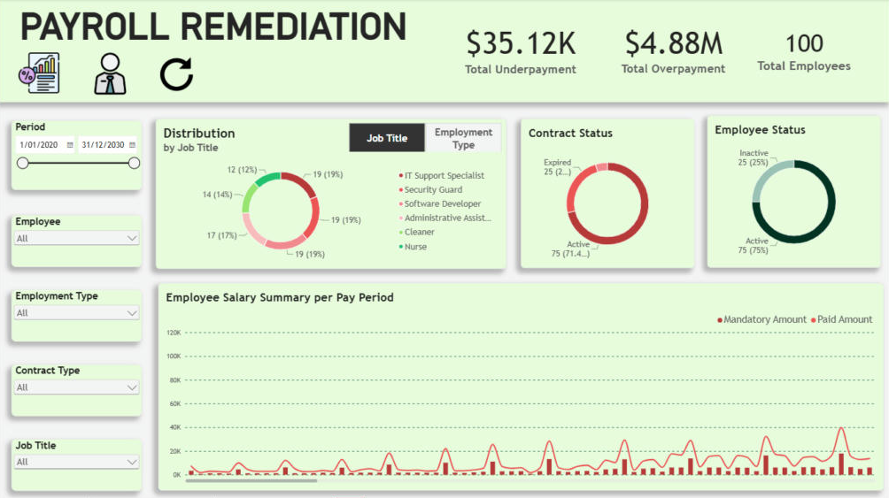
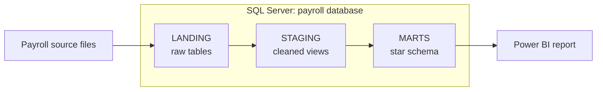
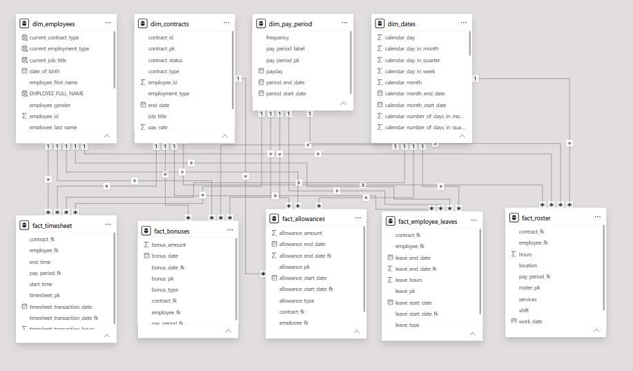
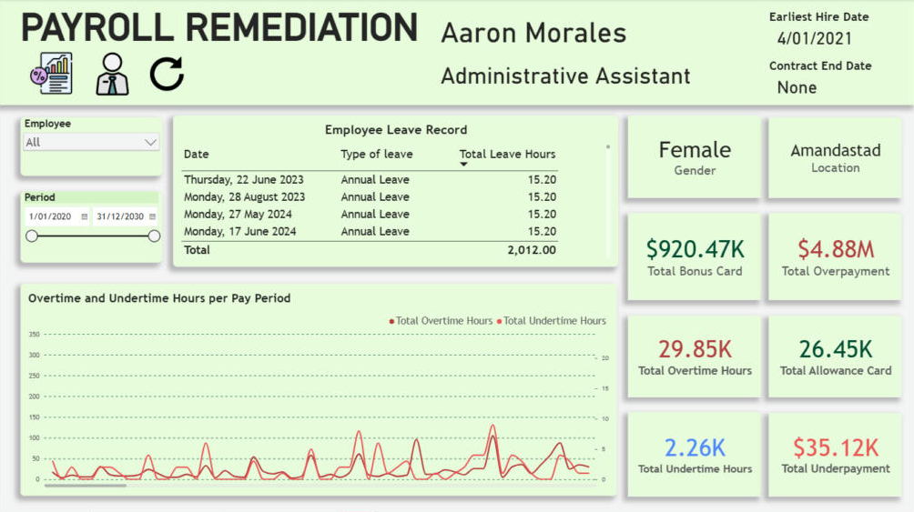

# Payroll Remediation Analytics

An end-to-end payroll analytics project: raw payroll files are loaded into a SQL Server data warehouse, modelled into a star schema, and surfaced in a Power BI report that shows which employees were paid below their minimum entitlement, by how much, and in which pay periods.

<p align="center">
  
</p>

## Table of Contents

- [Problem Statement](#problem-statement)
- [Data Source](#data-source)
- [Architecture](#architecture)
- [Semantic Model](#semantic-model)
  - [Relationships](#relationships)
  - [Measures](#measures)
- [Business Insights](#business-insights)
  - [Payroll Remediation (overview)](#payroll-remediation-overview)
  - [Employee Analysis](#employee-analysis)
  - [Recommendations](#recommendations)
- [Data Quality Issues Solved](#data-quality-issues-solved)
- [How to Run](#how-to-run)
- [Repository Structure](#repository-structure)

## Problem Statement

Payroll errors are rarely one big mistake. They build up from small mismatches: a casual loading that was not applied, a junior rate used after a birthday, a contract rate that fell behind the legal minimum when the minimum went up. Each one is hard to see in a payslip, and across several years they add up to a liability the business has to find, quantify and repay.

This project answers three questions for an HR or finance team:

1. **How much is owed?** Total underpayment across the workforce, and how it compares with what was paid above the minimum.
2. **Where does it come from?** Which pay periods, employment types, contract types and job titles carry the gap.
3. **What happened to one person?** For a selected employee: leave taken, bonuses, allowances, overtime and undertime hours over time.

The report compares two amounts for every employee in every pay period:

- **Mandatory Amount** is the legal floor: the minimum hourly rate in force on the day, adjusted for junior age and casual loading, applied to ordinary hours and paid leave.
- **Paid Amount** is what payroll actually paid: the contract rate applied to hours worked, with overtime and night-shift loadings, plus paid leave, allowances and bonuses.

When Paid falls below Mandatory in a pay period, the difference is an **underpayment** and is owed to the employee. When Paid is above Mandatory, the difference is labelled **overpayment**; it measures pay above the legal floor, not an amount to recover.

## Data Source

The dataset is synthetic and was generated for this project, so no real employee appears in it. It mimics what a payroll or HR system would export. Timesheets cover **4 January 2021 to 29 April 2025**.

| Source file | Landing table | Rows | What it holds |
|---|---|---:|---|
| Employee details | `lnd_employee_details` | 100 | One row per employee: name, gender, location, hire and termination dates |
| Contract details | `lnd_contract_details` | 105 | Pay rate, job title, payment frequency, contract and employment type |
| Timesheet | `lnd_timesheet` | 45,607 | Hours actually worked per day, with start and end time |
| Roster | `lnd_roster` | 14,034 | Hours scheduled per shift |
| Allowance | `lnd_allowance` | 2,365 | Allowance type, amount and validity dates |
| Bonus | `lnd_bonus` | 848 | Bonus type, amount and date |
| Employee leave | `lnd_employee_leave` | 378 | Leave type, dates and hours |
| Time off in lieu | `lnd_time_off_in_lieu` | 100 | Overtime banked and when it was used |
| Tax rates | `lnd_tax_rates` | 30 | Income brackets by year |
| Junior pay rates | `lnd_junior_pay_rates` | 6 | Percentage of the adult rate for ages under 16 through 20 |
| Minimum pay rates | `lnd_minimum_pay_rates` | 6 | Hourly permanent and casual minimums by effective date |
| Pay rate adjustments | `lnd_pay_rate_adjustments` | 6 | Casual loading, overtime and penalty multipliers |

## Architecture

The warehouse lives in a SQL Server database called `payroll` and is split into three schemas. Each schema has one job, so a problem in the data can be traced to the layer that introduced it.

| Layer | Schema | Object type | Purpose |
|---|---|---|---|
| 1 | `LANDING` | Tables | Source files loaded as they arrive, with no changes |
| 2 | `STAGING` | Views | Columns selected and renamed, business keys derived (for example `pay_rate_id` and `tax_rate_id`) |
| 3 | `MARTS` | Views + date table | Star schema: surrogate keys, foreign keys to dimensions, pay period assignment |

Two design choices are worth calling out:

- **Surrogate keys are hashes.** `dim_employees` and `dim_contracts` build their primary key with `HASHBYTES('SHA1', ...)` over the business key and start date, so a new contract for the same employee gets its own key.
- **Pay period is resolved in the warehouse, not in the report.** Every fact row joins to the employee's contract that was active on the transaction date, then picks the weekly, fortnightly or monthly pay period according to that contract's payment frequency.



## Semantic Model

Power BI imports the `MARTS` schema: 8 dimensions and 6 fact tables, plus a `Measure` table that holds all DAX measures.

<p align="center">
  
  <br><em>Power BI model view</em>
</p>

### Relationships

Four dimensions filter five fact tables: 20 relationships, all one-to-many with single-direction filtering.

| Fact table | `dim_employees[employee_pk]` | `dim_contracts[contract_pk]` | `dim_pay_period[pay_period_pk]` | `dim_dates[date_pk]` |
|---|---|---|---|---|
| `fact_timesheet` | `employee_fk` | `contract_fk` | `pay_period_fk` | `timesheet_transaction_date_fk` |
| `fact_roster` | `employee_fk` | `contract_fk` | `pay_period_fk` | `work_date_fk` |
| `fact_employee_leaves` | `employee_fk` | `contract_fk` | `pay_period_fk` | `leave_start_date_fk` |
| `fact_bonuses` | `employee_fk` | `contract_fk` | `pay_period_fk` | `bonus_date_fk` |
| `fact_allowances` | `employee_fk` | `contract_fk` | `pay_period_fk` | `allowance_start_date_fk` |

Tables that stand alone:

- `dim_minimum_pay_rates`, `dim_junior_pay_rates`, `dim_pay_rate_adjustments` and `dim_tax_rates` are lookup tables. Measures read them by date range or age, so they need no relationship.
- `fact_time_off_in_lieu` is loaded but hidden and not yet used in the report.

### Measures

| Measure | Logic |
|---|---|
| `Mandatory Amount` | For each timesheet row: minimum hourly rate effective on that date × junior multiplier if the employee is under 21 × 1.25 if the contract is casual × ordinary hours (the lesser of worked and rostered hours). Paid leave is added at the same rate. Overtime, penalties, bonuses and allowances are excluded. |
| `Paid Amount` | For each timesheet row: contract pay rate × ordinary hours, + first 2 overtime hours at 1.5×, + further overtime at 2×, + hours after 10 PM at 1.25×. Paid leave, `Total Allowance` and `Total Bonus` are added. |
| `Underpayment Amount` | `MAX(0, Mandatory Amount − Paid Amount)` |
| `Overpayment Amount` | `MAX(0, Paid Amount − Mandatory Amount)` |
| `Total Underpayment` / `Total Overpayment` | The two amounts above evaluated for every employee × pay period and then summed, so a shortfall in one period is not cancelled out by a surplus in another. |
| `Total Overtime Hours` | Per timesheet row, worked hours above rostered hours, floored at zero. |
| `Total Undertime Hours` | Per timesheet row, rostered hours not worked, floored at zero. |
| `Total Bonus`, `Total Allowance` | Sum of bonus and allowance amounts. |

Overtime is found by matching each timesheet row to the roster on employee and date with `LOOKUPVALUE`.

## Business Insights

### Payroll Remediation (overview)

<p align="center">
  
</p>

Across 2021 to 2025 the business paid **$10.28M** against a legal minimum of **$5.43M**, about 1.9 times the floor. Underpayment still occurred in specific periods for specific people.

- **$35.1K is owed to 14 of 100 employees.** All 14 are still active. One employee accounts for $10.6K (30%), and the top four for 67%.
- **Casual staff carry 93% of it.** $32.7K of the underpayment sits with casual employees, against $2.1K for part-time and $347 for full-time.
- **Weekly pay runs carry 73%.** $25.7K arose in weekly pay periods and $9.5K in monthly ones. Fortnightly periods show none.
- **Two job titles make up 59%.** IT Support Specialist ($10.7K) and Administrative Assistant ($10.1K) lead, followed by Software Developer ($6.7K), Nurse ($4.9K) and Cleaner ($2.7K). Security Guards show none.
- **Junior rates matter, but only at the margin.** Two full-time employees under 21 were paid below their age-adjusted minimum, for $320 in total.
- **$4.88M was paid above the minimum**, of which bonuses contribute $920K and allowances $26K.

| Group | Underpayment | Paid above minimum |
|---|---:|---:|
| Casual | $32,669 | $1.56M |
| Part-time | $2,108 | $1.34M |
| Full-time | $347 | $1.99M |

### Employee Analysis

<p align="center">
  
</p>

This page drills into one employee at a time: leave record, bonus and allowance totals, and overtime against undertime hours per pay period.

- **Casual staff work almost half of all overtime and no undertime.** They logged 14,180 of 29,853 overtime hours (47%) and zero hours under roster. Full-time and part-time staff account for all 2,256 undertime hours.
- **Leave totals 2,012 hours:** 1,102 annual, 570 sick and carer's, 340 unpaid.
- **Allowances reach two roles only.** Nurses received $24.8K and Cleaners $1.7K; the other four job titles received none.

### Recommendations

1. **Repay the 14 affected employees.** The liability is small ($35.1K) and everyone owed is still employed, so it can be settled in a normal pay run.
2. **Review casual pay rates against the minimum wage at every increase.** Casual underpayment is the pattern to fix: the contract rate has to stay above the minimum rate with the 25% casual loading applied.
3. **Add a floor check to the weekly pay run.** Comparing Paid with Mandatory before pay is released would have caught 73% of the shortfall at the time it happened.
4. **Look at how casual overtime is rostered.** Casual staff working 47% of overtime with no undertime suggests rosters are set below the hours actually needed.

## Data Quality Issues Solved

Problems found while building the pipeline, and how each was handled:

| Issue | Cause | Fix |
|---|---|---|
| Loading the marts into Power BI failed with *"Cannot convert a char value to money"* | `employee_id` was imported as `money` in seven landing tables (`1.00`, `2.00`…) but as text in `lnd_bonus` (`E0000001`), so the join in `fact_bonuses` forced an invalid conversion | Strip the `E` prefix and `TRY_CAST` to the same type before joining; all 848 bonus rows now match an employee and a contract |
| Pay periods appeared in alphabetical order on chart axes | `pay_period_label` is text | Set *Sort by column* to `period_start_date` |
| Junior employees' minimum entitlement was understated 100-fold | `dim_junior_pay_rates` already stores the multiplier as a fraction (0.368), and the `Mandatory Amount` measure divided it by 100 again | Removed the second division; two under-21 employees with underpayments surfaced and the total moved from $34.8K to $35.1K |
| A cyclic reference blocked all queries from loading | A duplicated query (`dim_pay_period (2)`) referenced its original | Removed the duplicate and reloaded each table once |

## How to Run

1. Create the database and schemas, then import the source files into the `LANDING` schema.
2. Run `sql/Payroll_Project.sql` to create the `STAGING` and `MARTS` views.
3. In Power BI Desktop, connect to your server (database `payroll`), import the `MARTS` schema and refresh.

**Tools:** SQL Server 2022 Express, SQL Server Management Studio, Power BI Desktop.

## Repository Structure

```
payroll_project/
├── README.md
├── screenshots/             # Dashboard pages and model view
└── sql/
    └── Payroll_Project.sql  # Schemas, staging views, marts views
```
